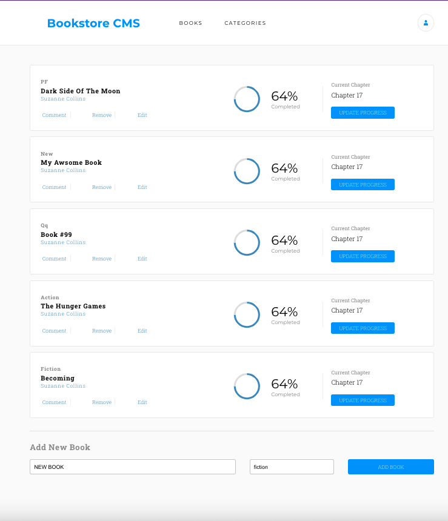

# BOOKSTORE

MVP website that allows users to: Display a list of books. Add a book. Remove a selected book.

based on [this](https://app.zeplin.io/project/5b35a9e13227086040f8eb75/screen/5b695e29bb8c844f118f9378) design



## Built With

- ReactJS
- CSS

## Getting Started

To get a local copy up and running follow these simple example steps.

### Setup

```bash
git clone git@github.com:elasfarc/bookstore.git
cd ./bookstore
```

### Install

```bash
npm install
```

### To Run it

```bash
npm start
```

### Build

```bash
npm run build
```

## Authors

👤 Mohammed Al-Asfar

- GitHub: [@githubhandle](https://github.com/elasfarc)

## 🤝 Contributing

Contributions, issues, and feature requests are welcome!

Feel free to check the [issues page](../../issues/).

## Show your support

Give a ⭐️ if you like this project!

## 📝 License

This project is [MIT](./MIT.md) licensed.
